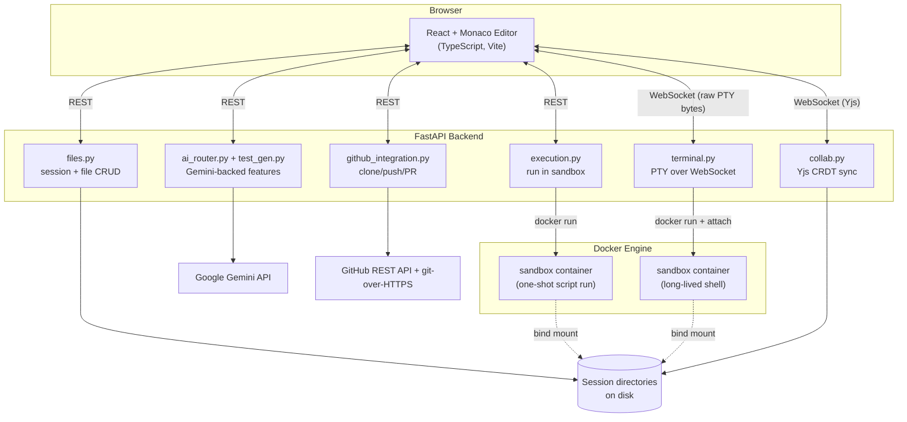
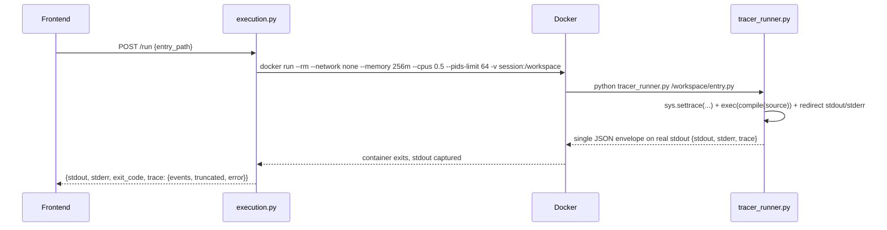
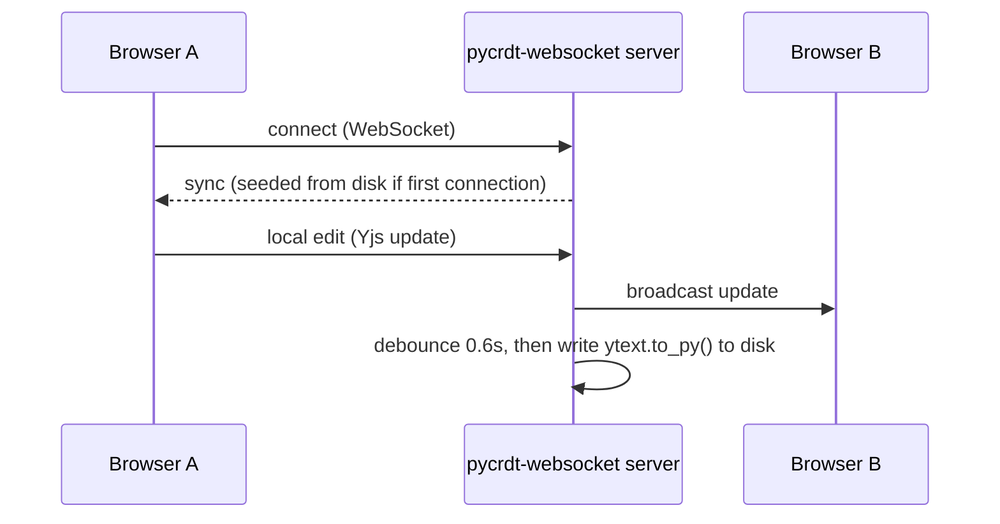
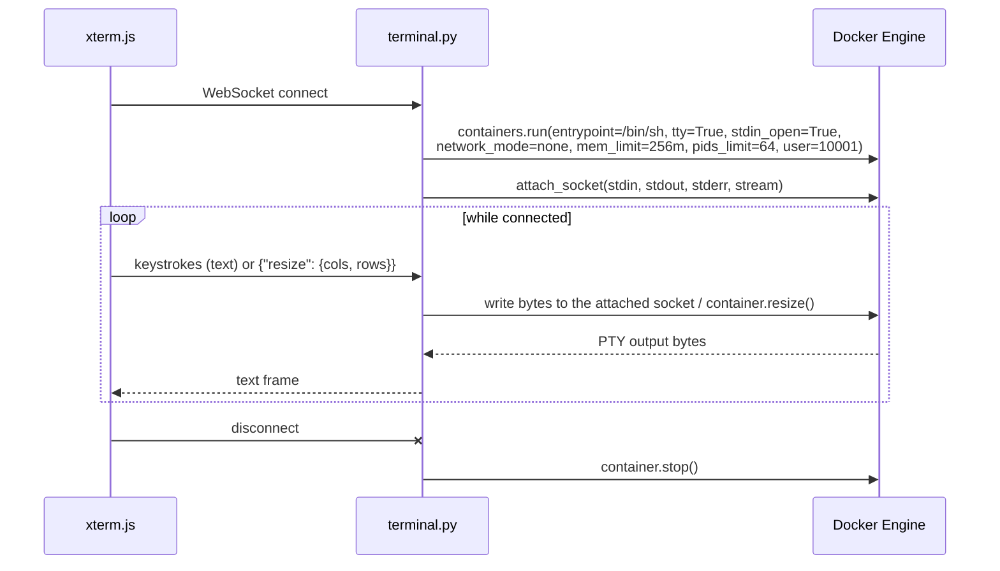
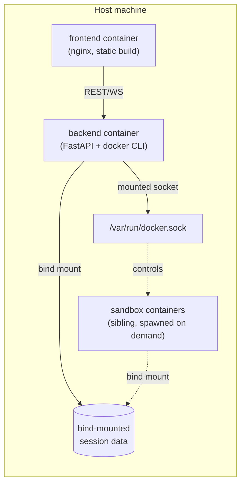

# PyTrace — System Design

This document describes how PyTrace is actually built: the components, the data flow
through each major feature, the security model, and the tradeoffs made along the way.
For setup and usage, see [README.md](README.md).

## 1. Goals and non-goals

PyTrace is a collaborative Python execution/debugging environment with AI assistance,
multi-file projects, and GitHub integration. It was built incrementally against an
explicit plan (P0 core → P1 add-ons → P2 stretch), verifying each feature end-to-end
before moving on rather than assuming code that "looks right" works.

Explicit non-goals: this is not a multi-tenant SaaS product. There's no user
authentication, no database, no persistence beyond the filesystem, and the security
model assumes a trusted-ish user base (a small team or a single person), not a
public, adversarial internet. See §7 for what that implies.

## 2. High-level architecture



Everything is stateless at the process level except the filesystem: a "session" is
just a directory under `backend/sessions/{session_id}/`. There's no database. The
frontend holds UI state in React; the backend holds none beyond what's on disk, which
is what makes horizontal scaling of the backend itself straightforward (see §8) even
though the *sandbox* side has real state (running containers).

## 3. Component responsibilities

| Component | File(s) | Responsibility |
|---|---|---|
| Session/file store | `sessions_store.py`, `files.py` | Session directories, path-traversal-safe resolution, file CRUD |
| Execution engine | `execution.py`, `docker/tracer_runner.py` | Runs a script in the sandbox, captures a full `sys.settrace` trace |
| AI features | `ai.py`, `ai_router.py`, `test_gen.py` | Gemini-backed explain/fix/review/test-generation |
| Real-time collaboration | `collab.py` | Yjs CRDT sync over WebSocket (file content *and* shared debug state) |
| GitHub integration | `github_integration.py` | Clone/status/commit/push via git CLI; PR list/create via GitHub REST API |
| Terminal | `terminal.py` | A real PTY-backed shell in a sandbox container, relayed byte-for-byte over WebSocket |
| Frontend shell | `App.tsx` and friends | Editor, file tree, debug sidebar, all the feature panels |

### API surface

```
POST   /api/sessions                                  create a session
GET    /api/sessions/{id}/files                        list files (tree)
GET    /api/sessions/{id}/files/{path}                 read a file
PUT    /api/sessions/{id}/files/{path}                 write a file
POST   /api/sessions/{id}/files/{path}                 create file/dir
DELETE /api/sessions/{id}/files/{path}                 delete file/dir
POST   /api/sessions/{id}/rename                       rename/move
POST   /api/sessions/{id}/run                          run a file in the sandbox, return trace
POST   /api/sessions/{id}/generate-tests               generate + genuinely execute tests
POST   /api/sessions/{id}/git/clone                    clone a repo into the session
GET    /api/sessions/{id}/git/status                   branch, remote, dirty files
POST   /api/sessions/{id}/git/commit-and-push          commit + push
GET    /api/sessions/{id}/git/prs                      list open PRs
POST   /api/sessions/{id}/git/prs                      create a PR from the current branch
WS     /api/sessions/{id}/terminal                     interactive shell
WS     /api/yjs/{id}/{file_path}                       Yjs sync room (file content, or the
                                                        synthetic "__debug__" room)
POST   /api/ai/explain-error                           explain a crash, grounded in the real trace
POST   /api/ai/explain-code                            explain a selected code block
POST   /api/ai/fix-error                               propose a corrected file (diff-previewed)
POST   /api/ai/review-code                             categorized review comments (JSON mode)
```

## 4. Data flow for each major feature

### 4.1 Run & trace



`tracer_runner.py` filters trace events to workspace files only (so it never traces
into the standard library), caps at 5,000 events, and captures each frame's locals via
a `repr()`-based safe serializer capped at 300 characters. The container's own
`ulimit -t 5` (CPU seconds) and `timeout --signal=KILL 15` (wall clock) are the first
line of defense against runaway code; the host adds a 25-second backstop in case
`docker run` itself never returns.

**Why `sys.settrace` and not a real debugger protocol (DAP)?** Simplicity and full
control over what's captured. A DAP-based approach would give step-into/breakpoints
against a live process, but here the entire trace is captured in one execution and
"stepping" in the UI is just moving an index into that already-captured array — no
live process to keep alive, no debugger-protocol client/server negotiation, and no
extra attack surface from a debug adapter with elevated introspection rights.

### 4.2 Multi-file imports work because of one non-obvious fix

`tracer_runner.py` calls `exec(code, {...})` rather than shelling out to
`python script.py`. That distinction matters: `python <script>` gets its script's own
directory added to `sys.path[0]` automatically; a bare `exec()` inside another
process does not. Without an explicit `sys.path.insert(0, dirname(target))` before the
`exec()`, a project with `import sibling_module` would fail with
`ModuleNotFoundError` even though `sibling_module.py` sits right next to the entry
file — a bug that went unnoticed for weeks because most manual testing used
single-file scripts. Fixed by inserting the target's directory into `sys.path` (and
setting `sys.dont_write_bytecode = True`, since importing a sibling module in the
user's own session would otherwise leave a `__pycache__` directory behind in their
project tree).

### 4.3 Real-time collaborative editing (Yjs)

Two independent CRDT rooms exist per session, both served by the *same* generic
WebSocket endpoint (`/api/yjs/{session_id}/{file_path}` — `file_path` can be any
string, including a synthetic one):

- **Per-file rooms** (`{session_id}/{file}`) hold a `Y.Text` bound to the Monaco model
  via `y-monaco`'s `MonacoBinding`. The backend seeds it from disk on first connection
  and debounce-persists changes back to disk (0.6s) via `pycrdt`.
- **The session-wide `__debug__` room** (§4.4) holds a `Y.Map`, not a `Y.Text` — the
  same endpoint code path handles both because it never assumes what's inside the
  room; a room with an untouched `Y.Text` simply never triggers the disk-persistence
  observer.



The backend is pure Python (`pycrdt` + `pycrdt-websocket`), the same CRDT wire
protocol as Yjs's own JS implementation — so there's no separate Node.js sync server
to run alongside FastAPI.

**A real bug this surfaced**: `MonacoBinding`'s constructor forces the Monaco model to
match the *local* (not-yet-synced) Y.Doc state immediately on construction. A
brand-new `Y.Doc` starts empty, so binding immediately would briefly (and
destructively) overwrite a file that already had real content, before the server's
seeded content arrived over the wire. Fixed by deferring `new MonacoBinding(...)`
until `provider.on('sync', isSynced => ...)` confirms the round-trip completed.

### 4.4 Shared collaborative debugging (driver model)

Extends the same Yjs mechanism rather than building a new subsystem — a
session-scoped room (not per-file) holds `{driverId, driverName, runResult, stepIndex,
breakpoints, activeFile}`. Whoever most recently clicked **Run** becomes the driver;
running always reclaims driver status (last-to-run wins) rather than negotiating a
handoff. Only the driver's step/breakpoint controls are enabled — everyone else's
local state mirrors the shared map, disabled controls are enforced both visually
(`disabled`) and functionally (the handler itself checks `isDriver` and no-ops).

### 4.5 AI features

All four AI features funnel through one `ai.py` module (`ask(system_prompt,
user_prompt, max_tokens, json_mode)`) wrapping the Gemini API (`gemini-3.7-flash`,
extended thinking explicitly disabled since it draws from the same output-token
budget and was observed silently truncating responses). `json_mode=True` uses
Gemini's structured-output mode for **Review Code**, so the response is
`json.loads()`-able directly rather than hoping the model followed a "please output
JSON" instruction in the prompt.

- **Explain Error / Explain Code**: free-text explanation, grounded in the *actual*
  captured trace values, not just the source code.
- **Fix Error**: same grounding, but the model outputs a complete corrected file,
  never auto-applied — shown in a Monaco `DiffEditor` for explicit accept/reject.
- **Review Code**: returns `[{line, category, comment}]`; rendered as real Monaco
  decorations (colored line highlight + native hover tooltip) per category
  (bug-risk/style/complexity), not just a text blob.
- **Generate Tests**: the model writes a self-contained test script following a fixed
  output contract (`PYTRACE_RESULT|<name>|PASS` / `|FAIL|<reason>` printed per test).
  The backend writes that script into the session as a real file and runs it through
  the *same* `execute_in_sandbox()` used by the plain Run button — genuinely executed,
  not just displayed, and the pass/fail is parsed from real process output.

Gemini's free tier caps at 20 requests/day for this model; a 429 is caught explicitly
and turned into a clear, actionable error rather than an unhandled 500 (an earlier bug
— unhandled `ClientError` was crashing the whole request with no CORS headers, which
surfaced in the browser as an opaque "Failed to fetch").

### 4.6 GitHub integration

Clone/status/commit/push shell out to the real `git` CLI (`subprocess.run`), using
`-c http.extraHeader="AUTHORIZATION: Basic <base64(x-access-token:TOKEN)>"` for
ephemeral, per-invocation auth that never touches `.git/config` or `git remote -v`.
PR list/create talk to the GitHub REST API directly via `httpx` (owner/repo parsed out
of the stored remote URL with a regex; `github.com` URLs are recognized, anything else
cleanly rejected with "not a GitHub repository").

The PAT is encrypted at rest with `cryptography.fernet` (`GITHUB_TOKEN_KEY`,
auto-generated into `.env` on first run in bare-metal dev — see §7.3 for why that
doesn't work the same way inside a container) and stored in a JSON file that is a
**sibling** of the session directory, not inside it — structurally unreachable
through the path-traversal-protected file API, and outside the cloned repo's own
working tree so it can never be swept up by `git add -A`.

### 4.7 Terminal (the trickiest part)



Docker's own TTY allocation stands in for `node-pty` here, since this is a Python
backend — `docker-py`'s `attach_socket()` is the "or equivalent" the plan's Week 10
goal allowed for. Same isolation as script execution: non-root (`uid=10001`), no
network, capped memory/cpus/pids — but long-lived (until WebSocket disconnect) with a
real shell as PID 1, instead of the execution sandbox's single-script-and-exit
entrypoint.

**The part that actually broke, twice, in ways only a real deployment surfaced**:
`attach_socket()`'s return type is transport-dependent. On Windows (Docker Desktop's
`npipe` transport) it returns an `NpipeSocket` with `.recv()`/`.sendall()`, so a naive
`sock.recv(...)` / `sock.sendall(...)` implementation works and looks
production-ready. Over the Unix socket every real Linux deployment uses instead
(mounting `/var/run/docker.sock`), the same call returns a plain `socket.SocketIO`
file-like wrapper — read-only, no `.sendall()` at all, and even a `.write()` fallback
raises `UnsupportedOperation` because the wrapper was opened in read-only mode.
`docker-py` ships a matching cross-platform *read* helper (`docker.utils.socket.read`)
but no equivalent for writes. The fix reaches through the read-only wrapper's `_sock`
attribute to the real underlying duplex socket for writing, while still using the
library's own `read()` helper (which already branches correctly per platform) for
reading. This was only caught by actually building and running the docker-compose
deployment on Linux transport — testing exclusively against the Windows dev
environment would never have surfaced it.

## 5. Sandbox isolation model

Every piece of user-supplied code — a plain script run, a generated test, or an
interactive shell — executes with the *same* constraints:

| Control | Value | Purpose |
|---|---|---|
| User | `uid=10001`, `--shell /usr/sbin/nologin` | Non-root; no usable login shell if something escapes the intended entrypoint |
| Network | `--network none` | No outbound network access at all — verified with a live `socket.connect()` returning `ENETUNREACH`, not just configured and assumed |
| Memory | `--memory 256m` | Caps runaway allocation |
| CPU | `--cpus 0.5` | Caps runaway compute |
| PIDs | `--pids-limit 64` | Caps fork bombs |
| Filesystem | only the session directory, bind-mounted at `/workspace` | No access to anything else on the host |
| Time (script run only) | `ulimit -t 5` (CPU seconds) + `timeout --signal=KILL 15` (wall clock) + 25s host backstop | Three independent layers so a hang can't survive all of them |
| Container lifetime | `--rm` (script run), explicit `container.stop()` on disconnect (terminal) | No orphaned containers |

None of this is taken on faith — every row above was independently verified by
actually running code that would violate it (a `socket.connect()` to a real external
IP, `cat /sys/fs/cgroup/pids.max`, `id`) and confirming the sandbox refused it.

### Path-traversal protection

`resolve_safe_path(session_dir, rel_path)` resolves the joined path and checks
`is_relative_to(session_dir)` on the *resolved* result — catching both `../../etc`
traversal and an absolute-path override (`/etc/passwd`), since checking containment
before resolution is the mistake that lets either kind slip through.

## 6. Known limitations and tradeoffs

Stated plainly, the way you'd want to hear it in an interview rather than discover it
in production:

- **No authentication.** Anyone with a session ID (or a shared link) has full read/
  write/execute access to that session. Fine for a trusted small team or solo use;
  not fine for a public-internet multi-tenant product.
- **The `docker.sock` mount is a real privilege boundary.** In the docker-compose
  deployment, the backend container has the host's Docker socket bind-mounted in, so
  it can start/stop *any* container on the host, not just sandboxed ones — a
  compromised backend process is effectively root on the host. This is the standard
  "Docker-outside-of-Docker" pattern and there's no way to give a containerized
  backend the specific narrow ability to spawn sibling containers without this
  tradeoff; it's mentioned explicitly rather than hidden.
- **No automated test suite.** Every feature in this project was verified by hand —
  real HTTP/WebSocket calls, real Docker containers, real (or realistically mocked)
  Gemini responses — rather than by an automated regression suite. That verification
  was thorough at the time, but nothing prevents a future change from silently
  breaking something a human isn't in the loop to notice.
- **`tsc --noEmit` without a project reference in scope silently checks zero files.**
  This bit the project directly: the root `tsconfig.json` is a "solution file"
  (`"files": []`, only `references`), so a plain `npx tsc --noEmit` compiled nothing
  and reported success every single time it was run, for the entire project, while
  real type errors (`Response.json()` returning `unknown` in this TypeScript version,
  a stale prop-name mismatch in `FileTree.tsx`) sat undetected until the actual
  production build (`tsc -b && vite build`) was run for the first time, only when
  writing this deployment setup. Fixed both the real bugs and the verification habit.
- **Single-request-response AI, no streaming.** Explain/Fix/Review wait for the full
  Gemini response before showing anything. Fine at current response sizes; would feel
  slow for longer completions.
- **Frontend bundle is large** (~4.5 MB before gzip, ~1.2 MB after) because Monaco
  ships every language's tokenizer by default. Not optimized — a real next step would
  be trimming Monaco's language contributions to just Python/JSON/Markdown.
- **`GITHUB_TOKEN_KEY` persistence differs by deployment.** In bare-metal dev, the
  backend auto-generates it into `.env` on first run and it persists naturally on the
  real filesystem. Inside a container, `.env` isn't a mounted volume, so the
  auto-generated key would be silently regenerated (and previously-encrypted tokens
  would fail to decrypt) on every container recreation — the documented fix is to
  generate one explicitly and pass it via the compose environment instead of relying
  on the auto-persist path.
- **No rate limiting on any endpoint.** A user (or a bug in the frontend) can trigger
  runaway Docker container creation or Gemini calls; the resource caps limit the
  *blast radius* per container, not the *rate* of container creation.

## 7. Deployment topology



The backend container talks to the **host's** Docker daemon over the mounted socket
to spawn sandbox containers as **siblings**, not nested containers — Docker-in-Docker
isn't used or needed. This creates one subtlety worth naming explicitly:
`execution.py`'s and `terminal.py`'s `docker run -v <src>:/workspace` calls are
interpreted by the *host* daemon, so `<src>` has to be a path meaningful *on the
host*, not inside the backend's own container filesystem. `sessions_store.py`'s
`host_mount_path()` handles this translation: unset (`HOST_SESSIONS_DIR` not
configured — the bare-metal dev case, where the backend runs directly on the same
machine as the daemon), a session path already *is* a host path, no translation
needed; set (the docker-compose case), it rebases the internal path onto the
host-side equivalent. Verified by actually running the full compose stack and
confirming a spawned sandbox container could see and execute a file written through
the containerized backend — not just checked as a string transformation in isolation.

## 8. Scaling considerations (if this went further)

Not implemented, but the natural next steps if this needed to handle more load:

- **Backend**: stateless beyond the filesystem, so horizontally scaling the FastAPI
  process is straightforward *if* sessions live on shared storage (NFS, EFS, or
  similar) reachable by every backend replica and by whichever host runs the sandbox
  containers.
- **Sandbox containers**: currently spawned on the same host as the backend. At real
  scale, this is the part that would need a dedicated execution fleet (a job queue
  handing sandbox runs to a pool of worker nodes) rather than the backend spawning
  containers on its own host directly.
- **Yjs rooms**: currently in-process, in-memory (`pycrdt-websocket`'s
  `WebsocketServer`) — fine for a single backend instance; multiple instances would
  need a shared pub/sub layer (Redis, or `pycrdt`'s own persistence hooks) so two
  users in the same room don't land on different backend replicas with no way to see
  each other's edits.
- **Database**: none exists today (sessions are directories, GitHub tokens are a JSON
  file per session). A real multi-user product would need one for session metadata,
  auth, and rate-limiting — deliberately out of scope here.
